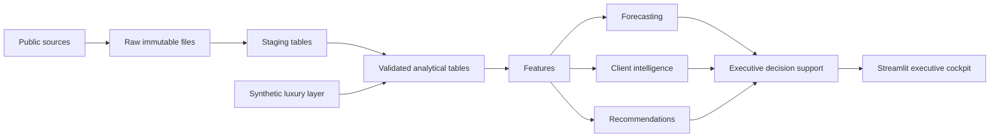

# Architecture

```mermaid
flowchart LR
    A[Public sources] --> B[Raw immutable files]
    B --> C[Staging tables]
    C --> D[Validated analytical tables]
    S[Synthetic luxury layer] --> D
    D --> E[Features]
    E --> F[Forecasting]
    E --> G[Client intelligence]
    E --> H[Recommendations]
    F --> I[Executive decision support]
    G --> I
    H --> I
    I --> J[Streamlit executive cockpit]
```

The synthetic layer is joined only after source-level validation and is labeled throughout model outputs.
